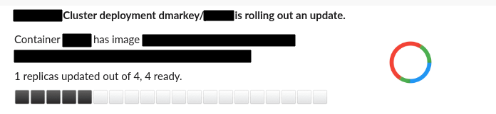
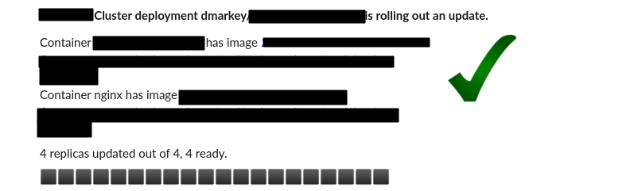
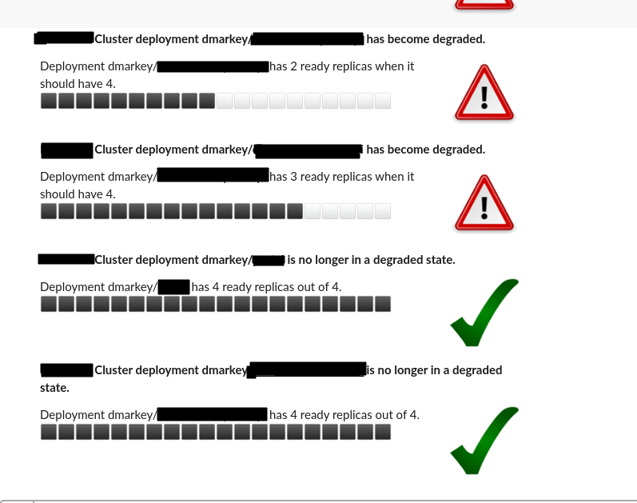

# kube-lookout

A utility to post changes to kubernetes deployments to various notification channels. 

Developed particularly for use with flux but can be used with any Kubernetes set-up. 

## What does it do?

It listens to kubernetes deployment states and is interested when:

1. Any kubernetes deployment is rolling out a new version
2. If a kubernetes deployment is not healthy (Ready replicas is less than expected replicas)

It posts nice dynamic status updates to the notification channel.

*Please don't use this to replace more mature monitoring tools (prometheus etc)*, this is for informational purposes only.

## Usage

```
pipenv install
pipenv run python kube-lookout.py --config <path-to-config.yml>
```

## Configuration

The config file lets you configure one or more receivers. Each receiver can have 1 or more team definition, which provides the authentication token, as well as the channel to notify on.

### Config File

**Supported Receivers**
- slack
- flowdock

**Images**

The URLs of images used for the notifications. Defaults to kinda ugly creative commons images, but does the job. (dont use SVGs I learned.)

Note, images are only supported by the *slack-receiver* at the moment.

---

See the [example-config](./config.example.yml) 
```yaml
---
cluster_name: "Kubernetes Cluster"
images:
  ok: "https://upload.wikimedia.org/wikipedia/commons/thumb/f/fb/Yes_check.svg/200px-Yes_check.svg.png"
  warn: "https://upload.wikimedia.org/wikipedia/commons/thumb/6/6e/Dialog-warning.svg/200px-Dialog-warning.svg.png"
  progress: "https://i.gifer.com/80ZN.gif"
receivers:
  slack: 
    cluster_ops:
      channel: "#cluster-ops"
      token: "{LEGACY_SLACK_TOKEN}"
    sre:
      channel: "#sre"
      token: "{LEGACY_SLACK_TOKEN}"
  flowdock:
    cluster_ops:
      token: "{FLOWDOCK_TOKEN_CLUSTER_OPS}"
    sre:
      token: "{FLOWDOCK_TOKEN_SRE}"
```

You can specify multiple receivers as well as multiple team/channels.

Notifications will be sent to all matching routes.

**Environment Var Support**

The config file supports Python's string formatting.

In the example, *${LEGACY_SLACK_TOKEN}* will be replaced by any matching environment variable with the same name. 

This is supported for any yaml value.

### Deployment Annotations

Enabling notifications for deployments is done through the use of  annotations (**required**).

```yaml
apiVersion: apps/v1
kind: Deployment
metadata:
  name: nginx
  annotations: 
    kube-lookout/enabled: "true"
    kube-lookout/team: sre
    kube-lookout/receiver: slack
```

## Screenshots

## Deployment Rollout


## Degraded deployment

